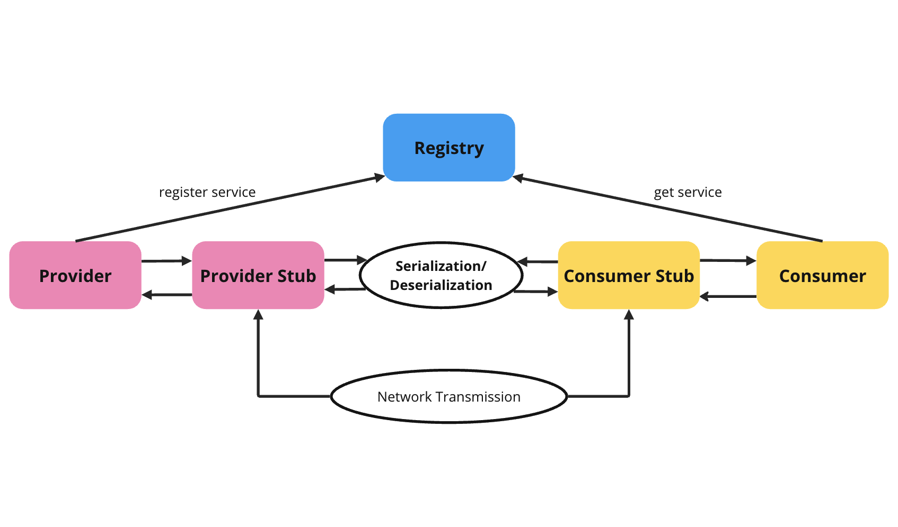

# xrpc

## Basic framework

- Registry: register and search of service addresses
  - Zookeeper
- Network transmission: Send network requests to pass information about target classes and methods
  - Socket
  - Netty
- Serialization/deserialization: enable Java objects to be transmitted in the network
  - JDK
  - Hessian
  - Kryo
  - Protobuf
- Dynamic agent: shield the underlying details of RPC
- Load balancing: avoid a single point of failure
- Transmission protocol: private RPC protocol

